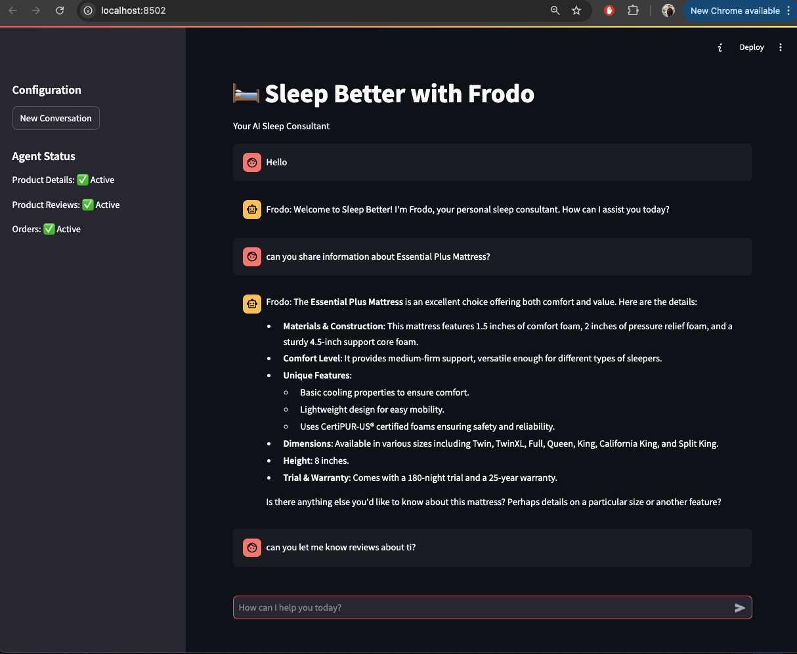
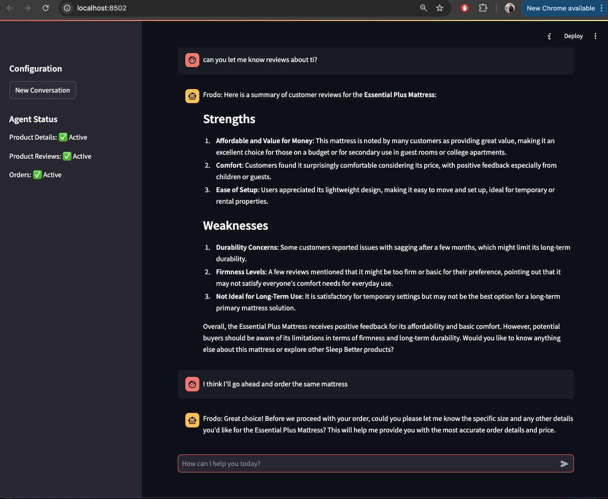
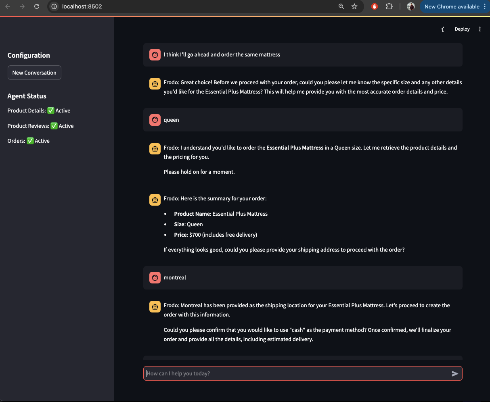
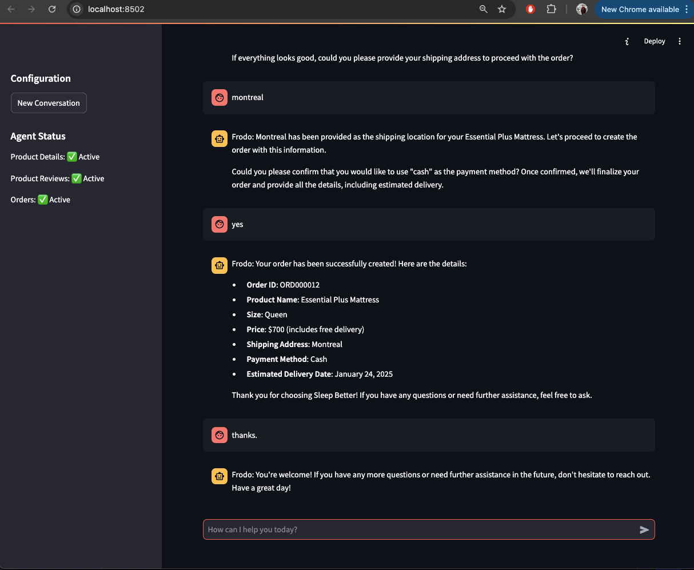

# Sleep Better AI - Multi-Agent Customer Support System

## Overview
This project implements a multi-agent customer support system that simulates a customer service representative named "Frodo". The system intelligently routes customer inquiries to specialized backend agents while maintaining a seamless, unified conversation interface.

## Table of Contents
- [Architecture](#architecture)
- [Features](#features)
- [Tech Stack](#tech-stack)
- [Project Structure](#project-structure)
- [Setup Instructions](#setup-instructions)
- [Running the Application](#running-the-application)
- [Implementation Details](#implementation-details)

## Architecture
The system implements a multi-agent architecture with the following key components:

1. **Streamlit Interface + Persona (Frodo)**: 
   - Provides the user interface
   - Acts as the single point of contact for customers
   - Manages conversation flow and state
2. **Specialized Agents**:
   - Product Details Agent: Handles product specifications and comparisons
   - Product Reviews Agent: Manages customer reviews and feedback
   - Orders Agent: Processes orders and tracks status
3. **Vector Databases**: Using pgvector for efficient similarity search
4. **SQLite Database**: For order management
5. **Knowledge Base**: Built from product catalog and reviews PDF documents

## Features

### Product Details Agent
- Provides comprehensive product information
- Answers queries about specific product features
- Performs product comparisons
- Handles natural language queries about product capabilities

### Product Reviews Agent
- Retrieves and presents existing product reviews
- Handles review-related queries
- Filters reviews based on rating/sentiment
- Supports adding new reviews for purchased products

### Orders Agent
- Processes new product orders
- Provides real-time order status updates
- Manages order-related inquiries
- Handles shipping and delivery tracking

### Core System Features
- Context-based conversation routing
- Seamless agent transitions
- Consistent persona maintenance
- Agent enable/disable functionality
- Error handling with persona-maintained responses

## Tech Stack
- **Application Framework**: Streamlit (for both UI and application logic)
- **Databases**: 
  - PostgreSQL with pgvector extension (for vector storage)
  - SQLite (for order management)
- **AI/ML**: 
  - OpenAI GPT-4o for conversation
  - OpenAI Embeddings for vector search
- **Docker**: For containerization and deployment
- **Vector Search**: pgvector for similarity search
- **Core Libraries**: 
  - phi for agent framework and knowledge base management
  - SQLAlchemy for database operations

## Project Structure
```
.
├── Dockerfile
├── data/
│   ├── SWE-GenAI_Take_Home/
│   │   ├── Sleep_Better_Product_Catalog.pdf
│   │   └── Sleep_Better_Product_Reviews.pdf
│   └── db/
│       └── orders.sqlite
├── docker-compose.yml
├── requirements_env.txt
└── src/
    ├── agents/
    │   ├── main_agent.py
    │   └── orders_agent.py
    ├── config/
    │   └── settings.json
    ├── db/
    │   ├── models/
    │   │   └── order.py
    │   └── orders.py
    ├── interface/
    │   └── app.py
    └── tools/
        └── order_manager.py
```

## Setup Instructions

### Prerequisites
- Docker and Docker Compose

### Environment Setup
1. Clone the repository:
```bash
git clone <repository-url>
cd sleep-better-ai
```

2. Create `.env` file:
```bash
cp .env.example .env
```

### NOTE: Update with your OpenAI API key in .env file


### Database Setup
The application uses two databases:
1. PostgreSQL with pgvector (via Docker)
2. SQLite for order management (auto-created)

Both databases are automatically initialized when running with Docker.

## Running the Application

### Using Docker (Recommended)
```bash
docker-compose up --build
```
The application will be available at: http://localhost:8502


### Running Without Docker (Not Recommended)
For development purposes only:
```bash
streamlit run src/interface/app.py
```
Note: This requires setting up PostgreSQL with pgvector extension manually.

## The chat interface looks like this:





## Implementation Details

### Key Components

1. **Vector Databases (pgvector)**:
   - Stores embeddings for product details and reviews
   - Enables semantic search capabilities
   - Supports hybrid search (vector + keyword)

2. **Knowledge Base**:
   - Built from PDF documents
   - Automatically chunked and embedded
   - Supports incremental updates

3. **Agent System**:
   - Context-aware routing
   - Maintains conversation history
   - Handles agent state management
   - Supports agent enabling/disabling

4. **Order Management**:
   - SQLite database for order tracking
   - Supports CRUD operations
   - Handles order status updates
   - Manages customer information

### Security Considerations
- API keys managed via environment variables
- Database credentials secured
- Input validation and sanitization
- Error handling with appropriate logging

